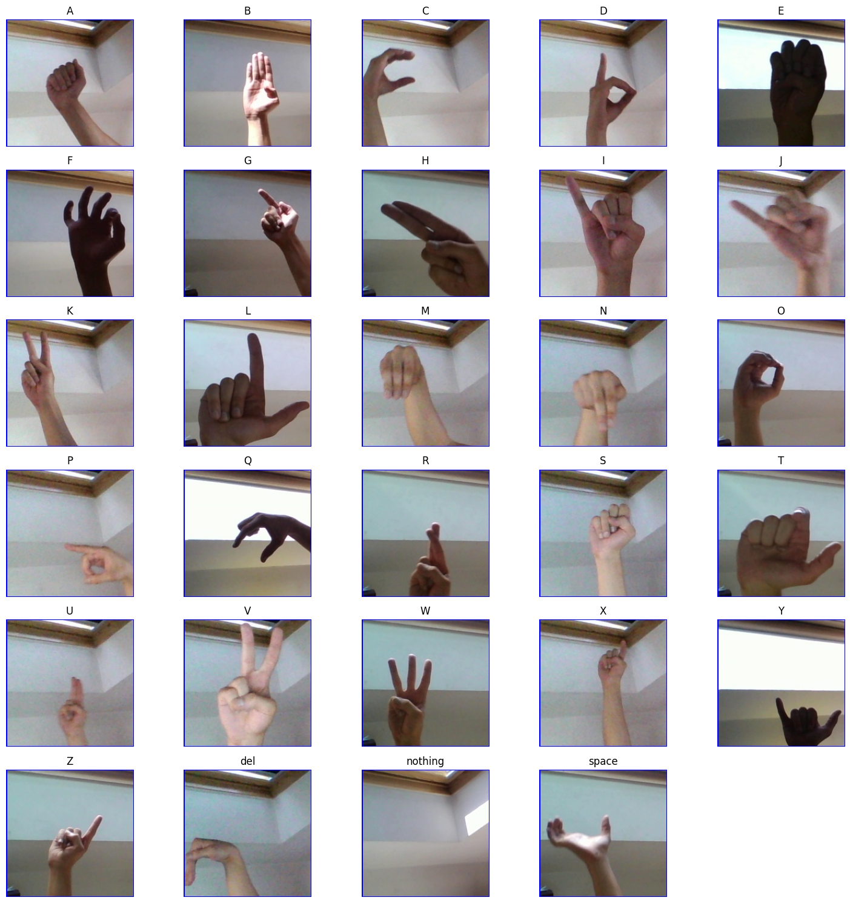

# 🤟 American Sign Language (ASL) Detection System

This project is a Deep Learning-based ASL recognition system that classifies hand gesture images into 29 classes:

- A to Z (26 classes)
- SPACE
- DELETE
- NOTHING

The model is built using a Convolutional Neural Network (CNN) and trained on a Kaggle dataset.

## 🎯 Objective

To detect and classify ASL hand signs from images using a deep learning model.

## 📊 Dataset (Kaggle)

Dataset used:
https://www.kaggle.com/datasets/grassknoted/asl-alphabet

### Structure:
asl_alphabet_train/
├── A/
├── B/
├── C/
...
├── Z/
├── space/
├── delete/
└── nothing/

## ⚙️ Dataset Setup (Google Colab)

### 1. Install Kaggle
pip install kaggle

### 2. Upload kaggle.json
from google.colab import files
files.upload()

### 3. Setup
mkdir -p ~/.kaggle
cp kaggle.json ~/.kaggle/
chmod 600 ~/.kaggle/kaggle.json

### 4. Download dataset
kaggle datasets download -d grassknoted/asl-alphabet
unzip asl-alphabet.zip

## 🧠 Model Architecture

- Conv2D
- MaxPooling2D
- Flatten
- Dense
- Dropout
- Softmax (29 classes)

## 🚀 Workflow

1. Load dataset from Kaggle
2. Preprocess images
3. Build CNN model
4. Train model
5. Validate model
6. Save model
7. Predict ASL signs

